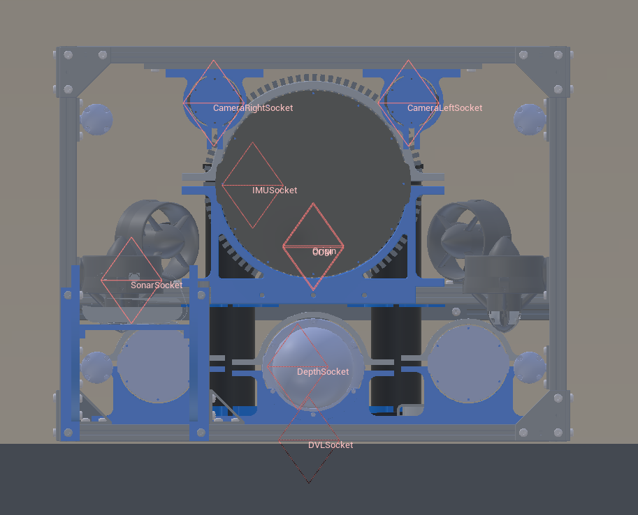

.. _`hovering-auv-agent`:

HoveringAUV
============

Images
------

.. image:: images/hovering-auv.png
   :scale: 40%

Description
-----------
Our custom in-house hovering AUV.

See the :class:`~holoocean.agents.HoveringAUV`.

Control Schemes
---------------

**AUV Thrusters (``0``)**
  An 8-length floating point vector used to specify the control on each thruster. They begin with the front right vertical thrusters, then goes around counter-clockwise, then repeat the last four with the sideways thrusters.

Sockets
-------

- ``COM`` Center of mass
- ``DVLSocket`` Location of the DVL
- ``IMUSocket`` Location of the IMU.
- ``DepthSocket`` Location of the depth sensor.
- ``SonarSocket`` Location of the sonar sensor.
- ``CameraRightSocket`` Location of the right camera with respect to the side it is mounted on as forwards.
- ``CameraLeftSocket`` Location of the left camera with respect to the side it is mounted on as forwards.
- ``Origin`` true center of the robot
- ``Viewport`` where the robot is viewed from.

.. image:: images/hovering-angled.png
   :scale: 50%

.. image:: images/hovering-top.png
   :scale: 50%

