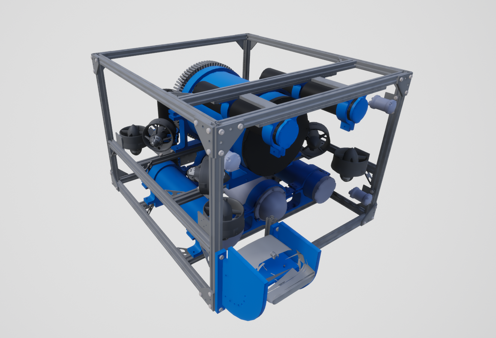

.. _`hovering-auv-agent`:

HoveringAUV
============

Images
------

Description
-----------
Our custom in-house hovering AUV.

See the :class:`~holoocean.agents.HoveringAUV`.

Control Schemes
---------------

**AUV Thrusters (``0``)**
  An 8-length floating point vector used to specify the control on each thruster. They begin with the front right vertical thrusters, then goes around counter-clockwise, then repeat the last four with the sideways thrusters.

Sockets
-------

- ``COM`` true center of mass as calculated from Solidworks.
- ``COMPerf`` perfected center of mass to be between thrusters and below COB for even floating.
- ``DVLSocket`` potential location for the DVL
- ``IMUSocket`` potential location for the IMU.
- ``Origin`` true center of the robot
- ``Viewport`` where the robot is viewed from.

.. image:: images/hovering-auv-sockets-close.png
   :scale: 50%

.. image:: images/hovering-auv-sockets.png
   :scale: 60%