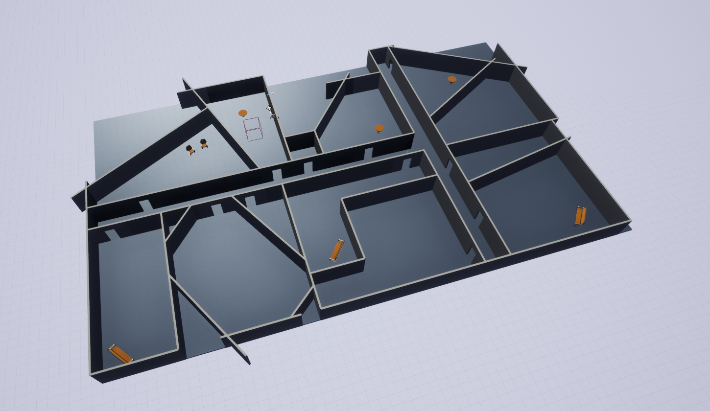

Rooms
=================

This is a simple world used for data generation in ECEN 522R, mobile robotics. It consists of various rooms for a TurtleAgent to navigate and generate data.

.. toctree::
   :maxdepth: 1
   :caption: Scenarios
   :glob:

   Rooms-*